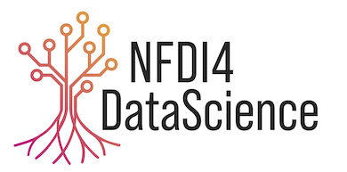

    

The DaMaLOS workshop is supported by the [NFDI4DataScience](https://www.nfdi4datascience.de/){:target="_blank"} (NFDI4DS) project (DFG project no. [460234259](https://gepris.dfg.de/gepris/projekt/460234259?language=en)), a German [National Research Data Infrastructure](https://www.nfdi.de/?lang=en){:target="_blank"} (NFDI) consortium.

The vision of NFDI4DS is to support all steps of the complex and interdisciplinary research data lifecycle, including collecting/creating, processing, analyzing, publishing, archiving, and reusing resources in Data Science and Artificial Intelligence. Opennes, metadata and research management for all research artifacts involved in Data Science and Artificial Intelligence are core to the project.

The overarching objective of NFDI4DS is the development, establishment, and sustainment of a national research data infrastructure (NFDI) for the Data Science and Artificial Intelligence community in Germany. This will also deliver benefits for a wider community requiring data analytics solutions, within the NFDI and beyond. The key idea is to work towards increasing the transparency, reproducibility and fairness of Data Science and Artificial Intelligence projects, by making all digital artifacts available, interlinking them, and offering innovative tools and services. Based on the reuse of these digital objects, this enables new and innovative research.