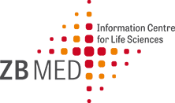

# Organizing committee

|  |  |

## Prof. Dr. Dietrich Rebholz-Schuhmann, ZB MED Information Centre for Life Sciences
Scientific director at ZB MED Information Centre for Life Sciences, Cologne, Germany. Prof. D. Rebholz-Schuhmann is a medical doctor and a computer scientist.  Until recently, he has been the director of the Insight Center for Data Analytics in Galway (the former DERI institute). His research is positioned in semantic technologies in the biomedical domain. In his previous research he has established large-scale on-the-fly biomedical text mining solutions and has contributed to the semantic normalization in the biomedical domain. 

## Dr. Leyla Garcia, ZB MED Information Centre for Life Sciences
Semantic retrieval team leader at ZB MED Information Centre for Life Sciences in Cologne, Germany. She is a Computer Scientist currently working on Life Sciences research related to semantic web, linked data, ontologies, and data science. She has participated in initiatives related to FAIRness for research software and recommendations for research open software.

## Prof. Dr. Soren Auer, TIB Leibniz Information Centre for Science and Technology University Library
Following stations at the universities of Dresden, Ekaterinburg, Leipzig, Pennsylvania, Bonn and the Fraunhofer Society, Prof. Auer was appointed Professor of Data Science and Digital Libraries at Leibniz Universität Hannover and Director of the TIB in 2017. Prof. Auer has made important contributions to semantic technologies, knowledge engineering and information systems. He is the author (resp. co-author) of over 100 peer-reviewed scientific publications. He has received several awards, including an ERC Consolidator Grant from the European Research Council, a SWSA ten-year award, the ESWC 7-year Best Paper Award, and the OpenCourseware Innovation Award. He has led several large collaborative research projects, such as the EU H2020 flagship project BigDataEurope. He is co-founder of high potential research and community projects such as the Wikipedia semantification project DBpedia, the OpenCourseWare authoring platform SlideWiki.org and the innovative technology start-up eccenca.com. Prof. Auer was founding director of the Big Data Value Association, led the semantic data representation in the Industrial/International Data Space, is an expert for industry, European Commission, W3C and member of the advisory board of the Open Knowledge Foundation.

## Prof. Dr. Maria-Esther Vidal
Head of the Scientific Data Management Research Group at TIB and a member of the L3S Research Centre at the University of Hannover; she is also a full professor (on-leave) at Universidad Simón Bolívar, Venezuela. Her interests include Big data and knowledge management, knowledge representation, and semantic web. She has published more than 170 peer-reviewed papers in Semantic Web, Databases, Bioinformatics, and Artificial Intelligence. She has co-authored one monograph, and co-edited books and journal special issues. She is part of various editorial boards (e.g., JWS, JDIQ), and has been the general chair, co-chair, senior member, and reviewer of several scientific events and journals (e.g., ESWC, AAAI, AMW, WWW, KDE). She is leading data management tasks in the EU H2020 projects iASiS, BigMedylitics, and QualiChain, and has participated in BigDataEurope, BigDataOcean; she is a supervisor of MSCA-ETN projects WDAqua and NoBIAS.

## Dr. Luiz Bonino
Dr. Luiz Olavo Bonino is the International Technology Coordinator of the GO FAIR International Support and Coordination Office and Associate Professor of the BioSemantics group at the Leiden University Medical Centre in Leiden, the Netherlands. His background is in ontology-driven conceptual modelling, semantic interoperability, service-oriented computing, requirements engineering and context-aware computing. In the last 5 years Luiz has led the development of a number of technologies and tools to support making, publishing, indexing, searching, evaluating and annotating FAIR (meta)data.