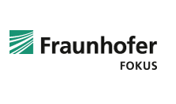
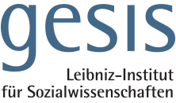

# Organizing committee

## Dr. Leyla Jael Castro, ZB MED Information Centre for Life Sciences
{:target="_blank"} Semantic retrieval team leader at ZB MED Information Centre for Life Sciences in Cologne, Germany. She is a Computer Scientist currently working on Life Sciences research related to semantic web, linked data, ontologies, and data science. She has participated in initiatives related to FAIRness for research software and recommendations for research open software.

## Dr. Sonja Schimmler, Fraunhofer FOKUS. 
{:target="_blank"} Dr. Sonja Schimmler is research group lead at Fraunhofer FOKUS. She is also an associated researcher at Technical University of Berlin. In her research, she focuses on the digitalisation and opening up of science and puts a special emphasis on research data infrastructures. Her research interests range from semantic web and linked data over data science and artificial intelligence to software engineering and human-centered computing.

## Dr. Danilo Dessi, GESIS Leibniz Institute for the Social Sciences.
{:target="_blank"}  Danilo is an enthusiastic computer scientist, currently a Senior Researcher at the Knowledge Technologies for the Social Sciences Department at GESIS - Leibniz Institute for the Social Sciences. He has served as PC member of several international conferences and workshops such as ESWC, ISWC, ACM SAC, BIAS@ECIR, DL4KG@ISWC, and so on. He has also co-organized workshops such as L2D@WSDM2021 and X-Sentiment@ESWC2021.  His research focuses on areas such as Knowledge Graphs, Machine Learning, Semantic Web, and Science of Science. 

## Prof. Dr. Dietrich Rebholz-Schuhmann, ZB MED Information Centre for Life Sciences, Univeristy Of Cologne
{:target="_blank"} Scientific director at ZB MED Information Centre for Life Sciences, Cologne, Germany. Prof. D. Rebholz-Schuhmann is a medical doctor and a computer scientist.  Until recently, he has been the director of the Insight Center for Data Analytics in Galway (the former DERI institute). His research is positioned in semantic technologies in the biomedical domain. In his previous research he has established large-scale on-the-fly biomedical text mining solutions and has contributed to the semantic normalization in the biomedical domain. 