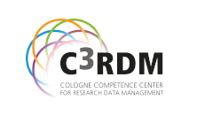

# Organizing committee

| {:target="_blank"} | {:target="_blank"} |

## Dr. Leyla Jael Castro, ZB MED Information Centre for Life Sciences
Semantic retrieval team leader at ZB MED Information Centre for Life Sciences in Cologne, Germany. She is a Computer Scientist currently working on Life Sciences research related to semantic web, linked data, ontologies, and data science. She has participated in initiatives related to FAIRness for research software and recommendations for research open software.

## Dr. Jens Dierkes, Cologne Competence Center for Research Data Management (C3RDM), University of Cologne
University- and City Library Deputy Head Research and Publication Support and member of the Cologne Competence Center for Research Data Management. Dr. Dierkes is interested in building and establishing e-research support across disciplines and across campus. He is also a member of NFDI4Health with a focus on networking, community, data stewardship, and training/education.

## Prof. Dr. Dietrich Rebholz-Schuhmann, ZB MED Information Centre for Life Sciences, Univeristy Of Cologne
Scientific director at ZB MED Information Centre for Life Sciences, Cologne, Germany. Prof. D. Rebholz-Schuhmann is a medical doctor and a computer scientist.  Until recently, he has been the director of the Insight Center for Data Analytics in Galway (the former DERI institute). His research is positioned in semantic technologies in the biomedical domain. In his previous research he has established large-scale on-the-fly biomedical text mining solutions and has contributed to the semantic normalization in the biomedical domain. 