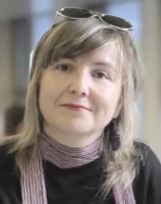

# Workshop schedule

**Date**: 23rd or 24th October 2022 TBD

**Time**: TBD

**Note:** Papers will be Open Access and available at the [PUBLISSO Fachrepositorium DaMaLOS 2022 collection](https://repository.publisso.de/){:target="_blank"}

## Schedule

<table>
<tbody>
<tr align="center">
<th>Time (CET)</th>
<th>Activity</th>
<th>Responsible</th>
</tr>

<tr>
<td>10'</td>
<td>Welcome and introduction</td>
<td>Organizers</td>
</tr>

<tr>
<td>45'</td>
<td><strong>Keynote: TBA</strong></td>
<td><strong><a href="#keynote">Keynote speaker: Prof. Eva María Méndez Rodríguez</a></strong></td>
</tr>

<tr>
<td>10'</td>
<td>Break</td>
<td></td>
</tr>

<tr>
<td colspan="3" align="center"><strong>First session: Paper presentations - Chair TBA</strong></td>
</tr>

<tr>
<td>60'</td>
<td>Papers presentations
 

</td>
<td>Accepted papers</td>
</tr>

<tr>
<td>15'</td>
<td>Break</td>
<td></td>
</tr>

<tr>
<td colspan="3" align="center"><strong>Second session: Paper presentations - Chair TBA</strong></td>
</tr>

<tr>
<td>60'</td>
<td>Papers presentations
 

</td>
<td>Accepted papers</td>
</tr>

<tr>
<td>10'</td>
<td>Break</td>
<td></td>
</tr>

<tr>
<td colspan="3" align="center"><strong>Third session: Group activity - Chair TBA</strong></td>
</tr>

<tr>
<td>40'</td>
<td>Activity for all</td>
<td>All</td>
</tr>

<tr>
<td>17:00 - 17:10</td>
<td>Wrap-up</td>
<td>Organizers</td>
</tr>
</tbody>
</table>

## Keynote

### Speaker

<table><tbody>
<tr>
<td></td>
<td>
Prof. Eva María Méndez Rodríguez 
<a href="https://www.uc3m.es/ss/Satellite/UC3MInstitucional/en/Detalle/Organismo_C/1371296356253/1371206549464/Eva_Maria_Mendez_Rodriguez" target="_blank">Web page</a> 
<a href="https://orcid.org/0000-0002-5337-4722" target="_blank">Publications</a> 
</td>
</tr>
</tbody></table>

Eva Méndez belongs to the first generation in Spain that has a diploma, a degree and a PhD in Documentation. Her doctoral thesis obtained the extraordinary doctorate award from UC3M (2002). She is a professor in the UC3M Department of Library and Information Science since March 1997. During the academic year 2005-06 she was a Fulbright-EU research fellow at the Metadata Research Center of the University of North Carolina in Chapel Hill (USA). She has participated in and / or directed various research projects and has advised many others in the areas of metadata, semantic web and web standards, open data, repositories and digital libraries, as well as information policies at various levels. She belongs to several technical and advisory committees: member of the Advisory Board of the Dublin Core Metadata Initiative DCMI (2005-), of the Advisory Board of OpenAire European Open Access infrastructure (2015-), Metadata2020 (2016-) or the Executive Committee of the CRUE University Library Network (REBIUN) (2015-2017). Since May 2016 he is a member of the High Level Advisory Group of the European Commission Open Science Policy Platform, representing YERUN. And in November 2017 it was recognized by the SPARC Europe Open Data Champion.

In the field of UC3M, she has been director of the University Master's Degree in Libraries and Digital Information Services (2009-2012), Assistant Vice-Chancellor for Infrastructure and Environment (2011-2015), Assistant Vice-Chancellor for Strategy and Digital Education (2015-2017). Currently, she is the Deputy Vice Rector for Scientific Policy on this subject at YERUN..

### Talk: TBD

