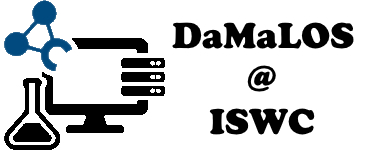

# DaMaLOS 2021 @ ISWC

<table>
  <tr>
    <td style="text-align:left">
      
    </td>
    <td>
    <strong>2nd Workshop on Data and research objects  
    management for Linked Open Science</strong>
     
    <italic>* research objects (e.g., software, workflows, knowledge graphs)</italic>
      
    <strong>Co-located with <a href="https://iswc2021.semanticweb.org/" target="_blank">ISWC</a> on the 24th or 25th of October 2021</strong>
      
    email: damalos2021@easychair.org  
    Follow us on twitter @ZB_MED #damalos2021
    </td>
  </tr>
</table>

## Motivation

Research data is the mirror of experimental work. Data, together with the software used to produce and analyze it, complements scientific publications and is core input to data- and knowledge-driven research. Most research activities follow the research data cycle, where data is continuously produced , transformed and (re)used, transitioning from one research to another. For this cycle to prosper, we require **Research Data and Research Objects Management (RDM and ROM) plans** supporting the [findable, accessible, interoperable and reusable (FAIR) principles](https://www.go-fair.org/fair-principles/). Despite playing an important role, data on its own is not sufficient to establish Open Science nor **Linked Open Science, i.e., Open Science plus Linked Open Data (LOD) principles**. LOD principles, aka LOD 5 stars, follow objectives that overlap with FAIR principles and Open Science (e.g., LOD 5 stars include “openness” and the use of “non-proprietary open formats”). In this workshop we will explore what is required for RDM to effectively instantiate Linked Open Science, including effective support for LOD, automation by, e.g.,machine/deep learning approaches, FAIR and Data Spaces/Ecosystems. Furthermore, we are interested in innovations to also support other Research Objects such as software and workflows, in order to get an integrated layer supporting all the edges of Linked Open Science. **We welcome contributions on data and research objects management plans, FAIRification supporting Open Science, linking approaches on metadata + publications + data + software, and research supporting open and transparent digital research ecosystems**.

