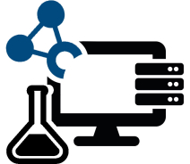

# DaMaLOS 2022 @ ISWC

<table>
  <tr>
    <td style="text-align:left">
      
    </td>
    <td>
    <strong>3rd Virtual Workshop on Research Objects(*) Metadata and Management for Linked Open Science - DaMaLOS 2022</strong>
     
    <italic>(*) research objects (e.g., data, software, workflows, knowledge graphs)</italic>
      
    <strong>Co-located with <a href="https://iswc2022.semanticweb.org/" target="_blank">ISWC</a> on the 23rd or 24th of October 2022 TBD </strong>
      
    email: damalos2022@easychair.org  
    Follow us on twitter @ZB_MED @UniCologne #DaMaLOS2022
    </td>
  </tr>
</table>

## Motivation

Experimental research involves various research objects including publications, software, data, workflows and tutorials, and inter-connections across, all key to FAIRness, reproducibility and transparency. The research lifecycle, starting with a question or hypothesis, requires data production, collection, and transformation, a process commonly supported by software and, following good practices, by testing and documentation. For this cycle to prosper, we require **Research Data and (in a more general scope) Research Objects Management Plans (RDMPs and ROMPs)** supporting the [FAIR principles](https://www.nature.com/articles/sdata201618){:target="_blank"} and its extensions covering reproducibility, transparency, trust, explainability, etc. Despite playing an important role, data on its own is not enough to establish **Linked Open Science**, i.e., Open Science plus Linked Open Data (LOD). LOD principles, aka [LOD 5 stars](https://5stardata.info/en/){:target="_blank"}, follow objectives overlapping with FAIR and Open Science (e.g., LOD includes “openness” and usage of “non-proprietary open formats”). In DaMaLOS we will explore requirements for research and research management to effectively instantiate an integrated layer supporting Linked Open Science. DaMaLOS welcomes contributions aligned to the following topics: **machine-actionable DMPs, machine/deep learning approaches around rich metadata, FAIRification, FAIR by design, FAIR tooling, data and software citation, scientometrics beyond the scholarly publication, Virtual Research Environments, and Research Spaces/Ecosystems**.

